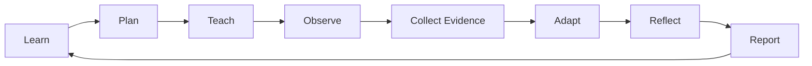

# Teaching Practice Lab

A source-driven knowledge base and future application for developing instructional expertise through the **Marzano Focused Teacher Evaluation Model (FTEM)**, evidence-based reflection, deliberate practice, and printable professional reports.

> This repository is an independent learning and professional-practice project. It is not affiliated with, endorsed by, or a replacement for the Marzano Evaluation Center, Instructional Empowerment, iObservation/IE Observation, a district evaluation instrument, or official evaluator training.

## Start here

- **[Documentation map](docs/SUMMARY.md)** — browse the project directly in GitHub.
- **[Project doctrine](docs/project/doctrine.md)** — what this system is and is not.
- **[FTEM framework](docs/frameworks/ftem/index.md)** — current framework research target.
- **[Sources](docs/sources/index.md)** — provenance and source hierarchy.
- **[Architecture](docs/architecture/index.md)** — docs-first now, interactive application later.
- **[Agent guide](AGENTS.md)** — instructions for Codex and other coding agents.

## Current phase

**Phase 1: Knowledge system + MkDocs documentation site.**

The repository deliberately starts as Markdown rather than as an application. The goal is to create a trustworthy system of record that is:

1. readable directly on GitHub,
2. renderable through MkDocs Material,
3. diagram-friendly,
4. usable by coding/research agents,
5. source-aware and copyright-conscious,
6. ready to become the content/data layer for a later Next.js application.

## Core loop



## Local docs

```bash
python -m venv .venv
# Windows: .venv\Scripts\activate
# macOS/Linux: source .venv/bin/activate
pip install -r requirements-docs.txt
mkdocs serve
```

Then open the local address shown by MkDocs.

## GitHub Pages

A Pages workflow is included in `.github/workflows/docs.yml`. In the repository settings, select **Settings → Pages → Source → GitHub Actions** once. Pushes to `main` will then build and deploy the MkDocs site.

## Important source boundary

The historical 2011 Learning Map supplied for research contains an explicit restriction on digitization. Do **not** commit or reproduce proprietary source PDFs, full rubrics, protocols, evaluator forms, scoring descriptors, or protected graphics unless permission is established. This repository should record citations, concepts, original analysis, original examples, and links to authoritative sources rather than cloning proprietary materials.
