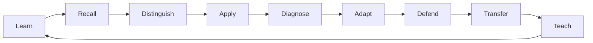

# Teaching Practice Lab

A **game-based instructional mastery platform** for learning, practicing, defending, and transferring teaching frameworks. The first framework is the **Marzano Focused Teacher Evaluation Model (FTEM)**.

> This repository is an independent learning and professional-practice project. It is not affiliated with, endorsed by, or a replacement for the Marzano Evaluation Center, Instructional Empowerment, iObservation/IE Observation, a district evaluation instrument, or official evaluator training.

## Product goal

The goal is not to memorize a rubric or complete a course. A learner should become able to:

**recall → recognize → distinguish → apply → diagnose → adapt → defend → transfer → teach**

instructional practices under realistic questioning.

The eventual application will combine a lightweight Next.js interface, persistent learner profiles, mastery tracking, challenge paths, boss assessments, spaced review, Socratic defense training, and selective Three.js interactions.

## Start here

- **[Documentation map](docs/SUMMARY.md)** — browse the project directly in GitHub.
- **[Product vision](docs/product/index.md)** — what the learning platform is becoming.
- **[Mastery system](docs/product/mastery-system.md)** — ranks, XP, confidence, and mastery dimensions.
- **[Challenge system](docs/product/challenge-system.md)** — scenarios, VS mode, defenses, and bosses.
- **[UI design](docs/product/ui-design.md)** — lightweight dark interface and Three.js boundaries.
- **[Build roadmap](docs/product/build-roadmap.md)** — implementation order.
- **[FTEM framework](docs/frameworks/ftem/index.md)** — current framework research target.
- **[Sources](docs/sources/index.md)** — provenance and source hierarchy.
- **[Agent guide](AGENTS.md)** — instructions for Codex and other coding agents.

## Current phase

**Knowledge system + mastery specification.**

The repository deliberately starts as Markdown rather than as an application. The goal is to create a trustworthy system of record that is:

1. readable directly on GitHub,
2. renderable through MkDocs Material,
3. diagram-friendly,
4. usable by coding/research agents,
5. source-aware and copyright-conscious,
6. ready to become the content/data layer for the Next.js learning platform.

## Core mastery loop



## Lightweight by design

Most screens should be ordinary semantic HTML/CSS/React: profile, lessons, dashboard, progress, challenges, results, and settings.

Three.js is reserved for interactions where motion or spatial representation improves learning, such as competency maps, evidence connections, concept comparisons, node unlocks, selected scenario environments, boss sequences, and rank progression.

The learning engine must remain functional without the 3D layer.

## Local docs

```bash
python -m venv .venv
# Windows: .venv\Scripts\activate
# macOS/Linux: source .venv/bin/activate
pip install -r requirements-docs.txt
mkdocs serve
```

Then open the local address shown by MkDocs.

## GitHub Pages

A Pages workflow is included in `.github/workflows/docs.yml`. In the repository settings, select **Settings → Pages → Source → GitHub Actions** once. Pushes to `main` will then build and deploy the MkDocs site.

## Important source boundary

The historical 2011 Learning Map supplied for research contains an explicit restriction on digitization. Do **not** commit or reproduce proprietary source PDFs, full rubrics, protocols, evaluator forms, scoring descriptors, or protected graphics unless permission is established. This repository should record citations, concepts, original analysis, original examples, and links to authoritative sources rather than cloning proprietary materials.
