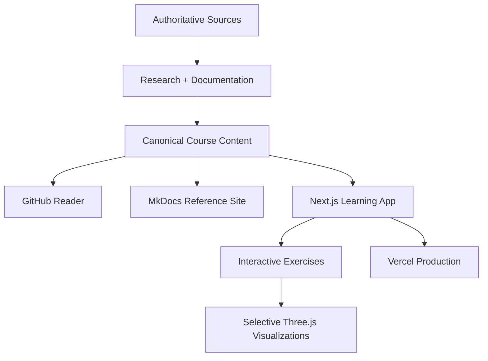

# Teaching Practice Lab

<p align="center">
  
  
  
  
  
  
</p>

**Teaching Practice Lab** is a publicly accessible, privately owned instructional learning platform created by **[@Gh0stlyKn1ght](https://github.com/Gh0stlyKn1ght)**.

Its first learning track focuses on the **Marzano Focused Teacher Evaluation Model (FTEM)** and the historical Marzano Learning Map. The platform is designed to move beyond passive rubric reading by combining concise lessons, source-backed explanations, diagrams, scenarios, comparison exercises, evidence analysis, and defense-style questioning.

> Teaching Practice Lab is an independent educational project. It is not affiliated with, endorsed by, or a replacement for the Marzano Evaluation Center, Instructional Empowerment, iObservation/IE Observation, any district evaluation instrument, or official evaluator training.

## What this app is

The goal is to help a teacher understand instructional practice deeply enough to answer questions such as:

- What instructional problem is being solved?
- Why is this strategy appropriate here?
- What student effect should occur?
- What evidence would demonstrate that effect?
- What would count as a false positive?
- What should change if the desired effect does not occur?
- How is this different from a nearby or commonly confused practice?
- Can the decision be defended without consulting notes?

The learning loop is:

```text
learn → recall → distinguish → apply → diagnose → adapt → defend → transfer
```

There are **no required learner accounts, XP systems, ranks, badges, streaks, or student records** in the core course.

## Architecture



### Presentation layers

- **GitHub** provides direct access to project documentation and source history.
- **MkDocs Material** provides the research and reference manual locally.
- **Next.js** provides the public learning experience.
- **Three.js** is reserved for interactions where motion or spatial representation improves understanding.
- **Vercel** is the intended production host for the public application.

## Development model

This repository does **not** use GitHub Actions as its CI gate.

Production changes must pass local release gates before they are intentionally promoted to production.

```bash
npm install
npm run ci:local
```

The local app gate verifies TypeScript and the production Next.js build. Documentation is validated separately with:

```bash
python -m venv .venv
# Windows: .venv\Scripts\activate
# macOS/Linux: source .venv/bin/activate
pip install -r requirements-docs.txt
mkdocs build --strict
```

See **[Local CI and Release Gates](docs/implementation/local-ci.md)** for the release policy.

## Run locally

```bash
npm install
npm run dev
```

Then open `http://localhost:3000`.

For the documentation site:

```bash
pip install -r requirements-docs.txt
mkdocs serve
```

## Project map

- **[Documentation map](docs/SUMMARY.md)**
- **[Product vision](docs/product/index.md)**
- **[Exercise system](docs/product/course-exercises.md)**
- **[UI design](docs/product/ui-design.md)**
- **[FTEM research](docs/frameworks/ftem/index.md)**
- **[Sources](docs/sources/index.md)**
- **[Architecture](docs/architecture/public-platform.md)**
- **[Agent instructions](AGENTS.md)**

## Ownership and license

Copyright © 2026 **Gh0stlyKn1ght**. All Rights Reserved.

This project is **not open source**. Public access to the website or visibility of repository contents does not grant permission to copy, redistribute, republish, sell, sublicense, create derivative products from, or deploy the source code or original course content.

See **[LICENSE](LICENSE)** for the repository license notice.

Third-party frameworks, trademarks, quotations, source materials, libraries, and referenced works remain the property of their respective owners and are governed by their own terms.

## Source and copyright boundary

The historical 2011 Learning Map used in project research contains an explicit restriction on digitization. Do not commit or reproduce proprietary source PDFs, full rubrics, protocols, evaluator forms, scoring descriptors, or protected graphics unless redistribution permission is established.

Teaching Practice Lab should use documented sources to create **original explanations, examples, diagrams, scenarios, and exercises**, rather than cloning proprietary training materials.

## Author

Designed and developed by **[@Gh0stlyKn1ght](https://github.com/Gh0stlyKn1ght)**.
