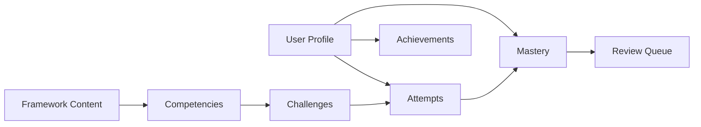

# Profile and Mastery Data Model

The game platform needs persistent **learner progress**, not student information.

## Core entities

### Profile

Represents the learner account and visible progression state.

```text
Profile
├── id
├── username
├── display_name
├── avatar
├── level
├── xp
├── rank
├── active_path
└── created_at
```

### Framework

A named instructional framework such as FTEM.

### Domain

A major grouping inside a framework.

### Competency

A learnable instructional practice or concept.

### Mastery

Per-user, per-competency state.

```text
Mastery
├── user_id
├── competency_id
├── recall
├── recognition
├── discrimination
├── application
├── diagnosis
├── adaptation
├── defense
├── transfer
├── teach
├── confidence
├── last_practiced_at
└── next_review_at
```

### Challenge

A data-driven learning activity. Challenge types include recall, recognition, discrimination, scenario, diagnosis, adaptation, defense, transfer, lesson simulation, evidence scanner, and boss.

### Attempt

An immutable historical record of a challenge attempt.

```text
Attempt
├── user_id
├── challenge_id
├── started_at
├── completed_at
├── result
├── score
├── confidence_before
├── confidence_after
├── response_summary
└── mastery_dimensions_exercised
```

Do not overwrite historical attempts when mastery changes.

### Achievement

Defines an achievement and its criteria.

### UserAchievement

Records when the user earned an achievement.

### ReviewQueue

Tracks spaced retrieval work that is due.

### BossClear

Records integrated domain-performance attempts separately from ordinary challenges.

## Data separation



Framework content should be versioned in the repository where possible. User state belongs in the application database.

## Privacy boundary

The first-party database should contain information about the learner using Teaching Practice Lab.

It should not require:

- student names,
- student IDs,
- grades tied to identifiable students,
- IEP/504 data,
- discipline records,
- parent information,
- uploaded student records.

Field Lab reflections should encourage anonymous observations such as:

> Most learners could explain the distinction after the second example.

rather than identifiable records.

## Derived values

Do not store every visual percentage as authoritative data. Values such as domain mastery, rank progress, or profile skill bars should be derived from underlying mastery records when practical.

## Auditability

Mastery changes should be explainable from attempts. If the platform says a competency is 82% confident, the system should be able to identify which retrievals, scenarios, defense attempts, and elapsed review interval contributed to that estimate.

This matters more than making the number look precise.
