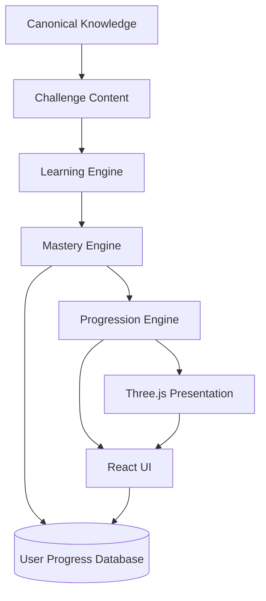

# Game Platform Architecture

The application should remain a **learning system with a game presentation layer**, not a game engine that happens to contain lessons.

## System boundary



The learning engine owns correctness and reasoning rules. The mastery engine owns competency state. The progression engine owns XP, ranks, badges, and unlocks. Three.js only reacts to application state.

## Proposed stack

### Core application

- Next.js
- React
- TypeScript

### Documentation and knowledge

- Markdown as canonical prose source
- MkDocs Material for research/reference documentation
- MDX where interactive Next.js learning content needs React components
- Mermaid for static diagrams

### 3D and animation

- `three`
- `@react-three/fiber`
- `@react-three/drei`
- Motion for ordinary UI transitions

### Graph / map UI

- React Flow for interactive competency and dependency maps
- Mermaid for documentation diagrams
- Cytoscape.js only if later graph-analysis requirements justify it

### Persistence

Profiles create a justified need for persistent application state. A hosted Postgres/auth platform such as Supabase is a reasonable default when implementation begins.

Persist only learning/profile data needed by the product. The platform does not need student records to function.

## Suggested application boundaries

```text
app/
├── (public)/
│   ├── page.tsx
│   └── about/
├── (auth)/
│   ├── login/
│   └── profile-setup/
└── (learn)/
    ├── dashboard/
    ├── paths/
    ├── learn/
    ├── practice/
    ├── defend/
    ├── field-lab/
    ├── mastery/
    └── profile/

content/
├── frameworks/
├── competencies/
├── lessons/
├── challenges/
├── scenarios/
└── bosses/

engine/
├── assessment/
├── mastery/
├── progression/
├── review/
└── achievements/

game/
├── world-map/
├── evidence-scanner/
├── concept-animation/
└── boss-scenes/

components/
├── learning/
├── mastery/
├── profile/
└── ui/
```

## Critical architecture rule

The following flow is mandatory:

```text
Question / Scenario
        ↓
Assessment Engine
        ↓
Mastery Update
        ↓
Progression Update
        ↓
UI State
        ↓
Optional Animation
```

Do not place mastery calculations inside Three.js components.

Do not calculate XP from animations.

Do not make a WebGL scene the only way to complete a core learning action.

## Content should be data-driven

A challenge should eventually look conceptually like:

```yaml
id: ftem-sbi-preview-vs-review-001
type: discrimination
framework: ftem
competencies:
  - previewing-new-content
  - reviewing-content
difficulty: practitioner
prompt: ...
required_dimensions:
  - discrimination
  - defense
scoring:
  evidence_required: true
  explanation_required: true
```

This enables the same challenge engine to support multiple frameworks and future content without hard-coding every screen.

## Lightweight loading strategy

The default application shell should not import Three.js.

Suggested approach:

```text
Dashboard
HTML/CSS/React only

Lesson
HTML/MDX only

Text scenario
HTML/React only

World Map
lazy-load React Flow or Three.js

Evidence Scanner
lazy-load Three.js

Boss Scene
lazy-load Three.js
```

This preserves a fast first load and keeps the visual layer optional.
