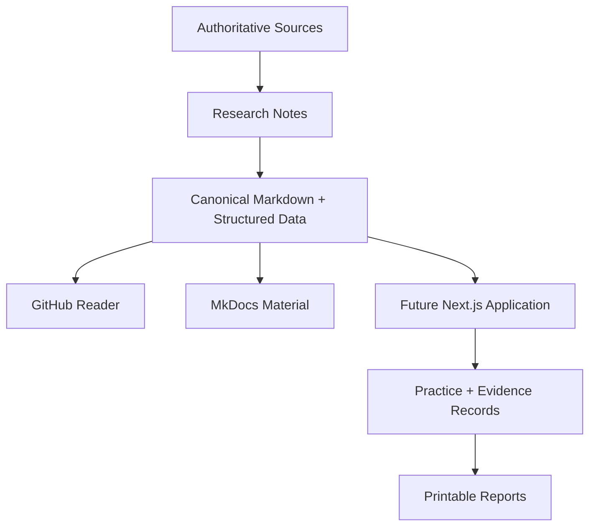

# Architecture Overview

## Principle

The repository is a **knowledge system first** and an application second.

## Layers

### Knowledge layer

Markdown, source metadata, diagrams, original training material, framework notes, schemas, and decision records.

### Documentation layer

MkDocs Material renders the knowledge layer without changing its meaning.

### Application layer

The future Next.js application adds interactivity: knowledge maps, practice records, evidence timelines, calibration scenarios, filtering, reflection tools, and report generation.

### Persistence layer

Start local-first for personal practice data. The repository itself should not contain real classroom evidence unless sanitized and intentionally used as an example.

## Architectural constraint

The application must consume or transform canonical content. It must not create a parallel copy of the training content that drifts away from the documentation.
