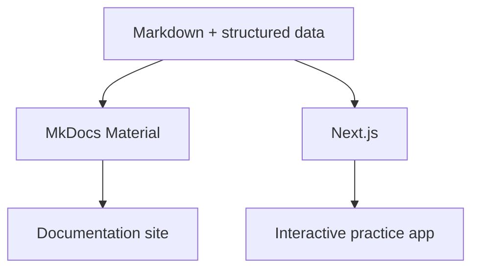

# Technology and Library Decisions

The project has two presentation layers with different jobs:

- **MkDocs Material** is the documentation and research reader.
- **Next.js** will become the interactive practice, evidence, visualization, and reporting application.

They should share source data and diagram conventions where practical, but they should not be forced to share rendering internals.

## MkDocs stack

### Core

| Library | Role | Decision |
|---|---|---|
| `mkdocs` | Static documentation generator | Use |
| `mkdocs-material` | Theme, search UX, navigation, Markdown features | Use |
| `pymdown-extensions` | Admonitions, tabs, enhanced fenced blocks, task lists | Use through Material |
| Mermaid | Diagrams embedded in Markdown | Use as default diagram language |

Material for MkDocs provides native Mermaid integration through `pymdownx.superfences`, which makes Mermaid a strong choice for diagrams that must remain readable in source and render on the documentation site.

Official references:

- https://www.mkdocs.org/
- https://squidfunk.github.io/mkdocs-material/
- https://squidfunk.github.io/mkdocs-material/reference/diagrams/
- https://mermaid.js.org/

## Diagram policy

Use Mermaid for diagrams that express knowledge or architecture:

- flowcharts,
- sequence diagrams,
- state diagrams,
- class diagrams,
- entity relationship diagrams,
- practice/evidence loops.

Do not use screenshots for information that can be represented as text + Mermaid. Text diagrams are diffable, searchable, reviewable, and agent-readable.

## Future Next.js stack

### Content

| Library | Role | Status |
|---|---|---|
| `next` + React + TypeScript | Application foundation | Planned |
| `@next/mdx` | Render trusted local MD/MDX | Planned |
| `remark` / `rehype` ecosystem | Markdown transforms when needed | Evaluate narrowly |
| `zod` | Runtime validation for structured records | Planned |

Next.js officially supports local MDX through `@next/mdx`, including App Router usage and custom React components. We should favor trusted repository content rather than arbitrary remote MDX because MDX is executable code.

Reference: https://nextjs.org/docs/app/guides/mdx

### Interactive knowledge map

| Library | Best use | Decision |
|---|---|---|
| `@xyflow/react` / React Flow | Interactive node/edge maps, custom nodes, selection, pan/zoom | Preferred |
| `cytoscape` | Larger graph analysis and graph algorithms | Optional later |
| `d3` | Custom low-level visualizations | Only when React Flow is insufficient |

**Default: React Flow.** Our framework is naturally a graph: domains → competencies → desired effects → evidence → practice records → growth goals. React Flow is better suited than a generic charting library for the primary interactive map.

References:

- https://reactflow.dev/
- https://js.cytoscape.org/
- https://d3js.org/

### Diagrams in Next.js

Use Mermaid for static explanatory diagrams so the same source can be understood in GitHub and MkDocs. Use React Flow when the user needs interaction, filtering, linked evidence, drill-down, or editing.

**Rule:** do not rebuild every Mermaid diagram in React Flow.

### Reports and printing

Start with browser-native HTML/CSS printing:

- semantic report pages,
- `@media print`,
- CSS page breaks,
- print-specific navigation removal,
- browser Print → PDF.

Do not add headless-browser PDF infrastructure until browser printing is proven insufficient.

Possible later libraries:

- `react-pdf` if true programmatic PDF composition becomes necessary,
- `pdf-lib` if we need to modify or merge existing PDFs.

### Forms and local data

Likely application libraries:

| Library | Purpose |
|---|---|
| `react-hook-form` | Evidence and reflection forms |
| `zod` | Schema validation |
| `idb` or Dexie | Local-first IndexedDB persistence |
| `date-fns` | Date handling |

Start local-first. A server database is a later decision, not a prerequisite.

### Search

MkDocs gets its built-in client-side search initially. For Next.js, start with a generated search index or lightweight client search. Add a hosted search service only when repository scale proves it necessary.

## Explicitly deferred

Do not add these in Phase 1:

- Supabase/Postgres,
- authentication,
- vector databases,
- AI scoring,
- cloud file storage,
- Puppeteer/Playwright PDF generation,
- complex CMS infrastructure,
- duplicated MkDocs and Next.js content trees.

The documentation must become trustworthy before the application becomes sophisticated.
