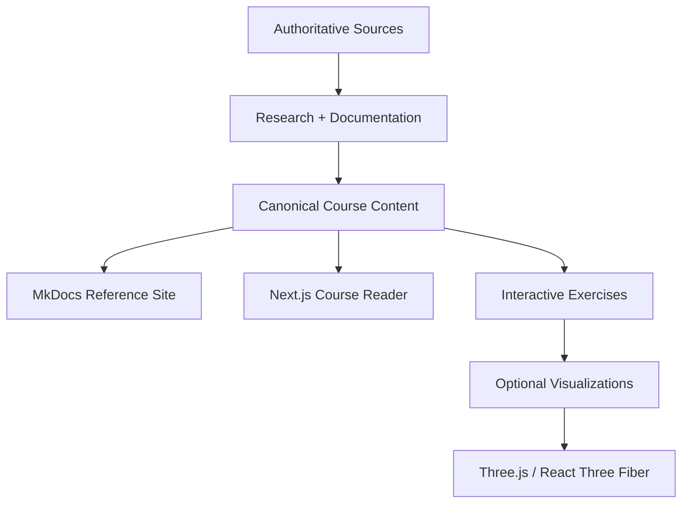

# Open Course Architecture

Teaching Practice Lab is an open-source, no-login learning site backed by a source-governed documentation repository.

## System model



There is no required learner database in the core architecture.

## Core principles

1. **Open by default.** Core lessons and exercises require no account.
2. **Source governed.** Framework claims must trace back to documented sources.
3. **Markdown first.** Prose should remain readable in GitHub and MkDocs.
4. **Interactive where useful.** Next.js adds exercises and richer lesson experiences.
5. **Three.js is optional.** Use WebGL only when motion or spatial representation teaches something better than text, SVG, Mermaid, or CSS.
6. **No student records.** The course does not need student information.
7. **No progress bureaucracy.** No XP, ranks, badges, streaks, profile database, or completion gate is required.

## Application shape

```text
app/
├── page.tsx
├── learn/
│   ├── foundations/
│   ├── planning/
│   ├── instruction/
│   ├── conditions/
│   └── professional-responsibilities/
├── practice/
└── reference/

content/
├── foundations/
├── frameworks/
├── competencies/
├── scenarios/
└── exercises/

components/
├── course/
├── exercises/
├── diagrams/
└── visualizations/
```

## Lightweight rendering rule

Prefer the cheapest representation that teaches the concept well:

```text
plain text / Markdown
        ↓
HTML + CSS
        ↓
SVG / Mermaid
        ↓
small React interaction
        ↓
Three.js
```

Three.js should be the last step, not the default.

## Course portability

A lesson should remain understandable when viewed:

- directly on GitHub,
- through MkDocs,
- through the Next.js site.

Interactive enhancements may add value in Next.js, but the underlying instructional explanation should not disappear when JavaScript or WebGL is unavailable.
