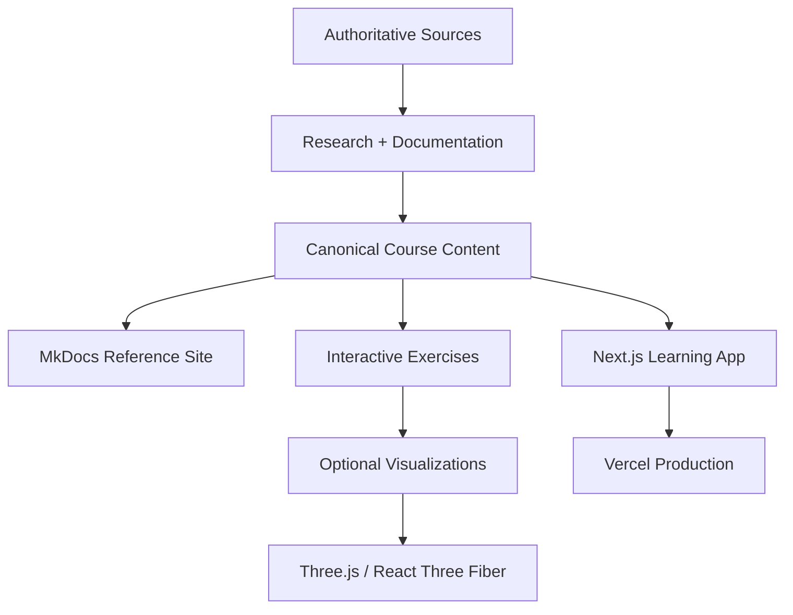

# Public Platform Architecture

Teaching Practice Lab is a **publicly accessible, proprietary learning platform**. The public may use the hosted course, but public access does not make the source code or original course content open source.

## System model



## Core principles

1. **Public learning access.** The hosted course is intended to be openly reachable on the web.
2. **Private ownership.** Original code, course content, exercises, diagrams, and design remain proprietary unless explicitly stated otherwise.
3. **Source governed.** Framework claims must trace to documented sources.
4. **Markdown first.** Core instructional explanations remain readable in the repository and MkDocs.
5. **Interactive where useful.** Next.js provides the primary public learning experience.
6. **Three.js is selective.** WebGL is used only when motion or spatial representation improves instruction.
7. **No student records.** The platform does not require identifiable student information.
8. **No mandatory progress system.** Accounts, ranks, XP, streaks, and completion gates are not part of the core course.
9. **Vercel production.** The Next.js application is intended to deploy to Vercel.
10. **Local release gates.** Validation runs locally before code is intentionally promoted to production.

## Application shape

```text
app/
├── page.tsx
├── learn/
│   ├── foundations/
│   ├── planning/
│   ├── instruction/
│   ├── conditions/
│   └── professional-responsibilities/
├── practice/
└── reference/

content/
├── foundations/
├── frameworks/
├── competencies/
├── scenarios/
└── exercises/

components/
├── course/
├── exercises/
├── diagrams/
└── visualizations/
```

## Lightweight rendering rule

Prefer the cheapest representation that teaches the concept well:

```text
plain text / Markdown
        ↓
HTML + CSS
        ↓
SVG / Mermaid
        ↓
small React interaction
        ↓
Three.js
```

## Deployment boundary

GitHub Actions is not a release gate for this project. The expected release flow is:

```text
local change
    ↓
local typecheck
    ↓
local production build
    ↓
local MkDocs strict build when docs changed
    ↓
review
    ↓
merge / intentional production promotion
    ↓
Vercel
```

The platform should never use a production deployment as the first place a build is validated.
