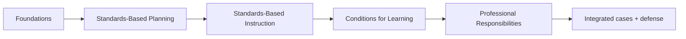

# FTEM Framework Map for Course Authoring

This document is the **course-authoring map**, not a replacement for an official Marzano rubric or evaluator protocol.

Teaching Practice Lab uses current public Marzano Evaluation Center material as the primary source for the modern framework. The current model is presented as **23 competencies across four domains**.

## Domain map

| Domain | Count | Course research status |
|---|---:|---|
| Standards-Based Planning | 3 | Public-source functional baseline complete; exact current titles for Elements 2 and 3 still unresolved |
| Standards-Based Instruction | 10 | Public-source baseline complete |
| Conditions for Learning | 7 | Public-source baseline complete |
| Professional Responsibilities | 3 | Public-source baseline complete |



The course order is a Teaching Practice Lab design choice. It should not be described as an official required FTEM training sequence.

## Standards-Based Planning

Current public Marzano Evaluation Center material confirms a three-element Planning domain.

### Element 1

**Planning Standards-Based Lessons/Units** is explicitly named in current MEC material. The public explanation emphasizes alignment among grade-level standards, lesson/unit design, accurate content, student tasks, and cognitive complexity.

### Element 2

Current MEC material describes the second element as connecting aligned tasks to traditional and digital resources that match the standard and the appropriate taxonomy level.

Older Focused Teacher Evaluation materials and secondary sources commonly use the title **Aligning Resources to Standard(s)**. Teaching Practice Lab treats that as a working/historical label until a current first-party MEC source explicitly confirms it.

### Element 3

Current MEC material describes the third element as ensuring planning includes measures that track all students' progress and help close achievement gaps.

Older Focused Teacher Evaluation materials and secondary sources commonly use the title **Planning to Close the Achievement Gap Using Data**. Teaching Practice Lab treats that as a working/historical label until a current first-party MEC source explicitly confirms it.

### Course-authoring rule

Teach the verified **functions** now. Do not silently upgrade the working/historical labels, exact focus statements, desired effects, evidence descriptors, planning-conference prompts, or developmental-scale language into current canonical protocol claims.

### Planning course model

```text
standard / learning target
        ↓
required cognitive demand
        ↓
aligned student task
        ↓
resources that support that task
        ↓
planned evidence of student progress
        ↓
data-informed response / support
```

High-value Planning comparisons:

- lesson/unit alignment vs resource alignment,
- resource alignment vs engagement,
- planning with data vs formative assessment,
- planning with data vs feedback,
- planning with data vs high expectations,
- planning for complexity vs students actually engaging in complex tasks.

See `docs/course/dossiers/standards-based-planning/` for the research dossiers and canonical-title status note.

## Standards-Based Instruction

Current public materials identify ten elements:

1. **Identifying Critical Content**
2. **Previewing New Content**
3. **Processing New Content**
4. **Using Questions to Help Students Elaborate on Content**
5. **Reviewing Content**
6. **Helping Students Practice Skills, Strategies, and Processes**
7. **Helping Students Examine Similarities and Differences**
8. **Helping Students Examine Their Reasoning**
9. **Helping Students Revise Their Knowledge**
10. **Helping Students Engage in Cognitively Complex Tasks**

For learning purposes, Teaching Practice Lab can organize them around building knowledge, deepening/practice, analysis/revision, and knowledge utilization. This organization must remain distinguishable from official domain structure.

## Conditions for Learning

Current public material identifies seven elements.

### Monitoring progress and feedback

1. **Using Formative Assessment to Track Progress**
2. **Providing Feedback and Celebrating Progress**

### Rigorous learning

3. **Organizing Students to Interact with Content**
4. **Using Engagement Strategies**

### Classroom environment

5. **Establishing and Acknowledging Adherence to Rules and Procedures**
6. **Establishing and Maintaining Effective Relationships in Student-Centered Classrooms**
7. **Communicating High Expectations for Each Student to Close the Achievement Gap**

High-value comparisons include formative assessment vs feedback, interaction vs engagement, engagement vs compliance, relationships vs permissiveness, and high expectations vs identical treatment.

## Professional Responsibilities

Current public material identifies:

1. **Adhering to School and District Policies and Procedures**
2. **Maintaining Expertise in Content and Pedagogy**
3. **Promoting Teacher Leadership and Collaboration**

These pages should be built around real professional decisions rather than generic professionalism language.

## Research coverage

Teaching Practice Lab now has a public-source baseline across the complete FTEM structure:

```text
Standards-Based Planning          3 / 3 functions researched
Standards-Based Instruction     10 / 10 elements researched
Conditions for Learning          7 / 7 elements researched
Professional Responsibilities    3 / 3 elements researched
------------------------------------------------------------
Total                            23 / 23
```

The remaining research problem is no longer basic coverage. It is **protocol depth and calibration**:

- exact current focus statements,
- exact desired effects,
- official evidence descriptors,
- authorized technique examples,
- developmental-scale wording,
- observer calibration,
- post-observation reasoning,
- current model-version history,
- NJ/district implementation context.

## Five conditions for increasing teacher expertise

Current Marzano Evaluation Center professional-learning articles repeatedly identify five conditions:

1. common language of instruction,
2. focused feedback and deliberate practice,
3. opportunities to observe and discuss teaching and learning,
4. clear criteria and a plan for success,
5. recognition of progress toward expertise.

These should influence the **course architecture**, but they are not additional FTEM teacher competencies.

## Observation reasoning pattern

The current FTEM overview describes a process centered on identifying the instructional strategy, monitoring the desired effect, examining student evidence, adapting when the desired effect is not sufficiently present, and using evidence in final/post-observation judgment.

Teaching Practice Lab can translate that into a learning sequence:

```text
What are you trying to accomplish?
        ↓
What instructional move are you using?
        ↓
What should students demonstrate?
        ↓
What evidence do you actually have?
        ↓
Is that evidence strong enough?
        ↓
If not, what changes?
        ↓
What evidence do you check next?
        ↓
Can you defend the decision?
```

The platform must not present itself as official observer certification or reproduce proprietary protocols.

## Historical 2011 map

The legacy 2011 Learning Map remains useful for lineage and vocabulary history. It should live in the course as **framework history**, not as the primary current learning track.

Do not reproduce the full historical proprietary map in public course content.

## Minimum authoring requirement for each competency

A competency is not ready to publish until the course can answer:

1. canonical name and domain, or explicit unresolved-title status,
2. source status,
3. plain-language explanation,
4. instructional/professional problem,
5. mechanism,
6. desired effect or explicit source gap,
7. evidence examples,
8. false positives / non-examples,
9. neighboring competencies and distinctions,
10. adaptation/improvement triggers,
11. plausible responses,
12. at least one computer-science classroom example,
13. retrieval prompts,
14. practitioner scenario,
15. expert/ambiguous scenario,
16. defense questions,
17. source notes and copyright boundary.

If we cannot fill one of these accurately, mark the gap rather than generating filler.
