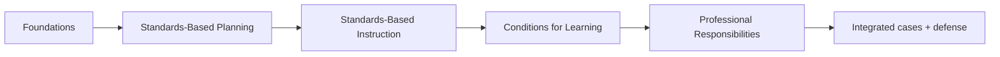

# FTEM Framework Map for Course Authoring

This document is the **course-authoring map**, not a replacement for an official Marzano rubric or evaluator protocol.

Teaching Practice Lab uses the current public Marzano Evaluation Center materials as the primary source for the modern framework. The current model is presented as **23 competencies across four domains**.

## Domain map

| Domain | Count | Course status |
|---|---:|---|
| Standards-Based Planning | 3 | Exact full labels still being source-verified |
| Standards-Based Instruction | 10 | Public current labels available |
| Conditions for Learning | 7 | Public current labels available |
| Professional Responsibilities | 3 | Public current labels available |



The course order is a Teaching Practice Lab design choice. It should not be described as an official required FTEM training sequence.

## Standards-Based Planning

Current public Marzano Evaluation Center material explicitly names **Planning Standards-Based Lessons/Units** and describes two additional planning areas involving aligned resources/tasks and measures for monitoring student progress and addressing achievement gaps.

### Course-authoring rule

Do **not** invent formal names for the remaining planning competencies from memory.

Until verified from authoritative current material, use working topic labels only in internal planning notes:

- standards-based lesson/unit planning,
- aligned resources and tasks,
- measures / progress monitoring.

These are descriptive placeholders, not claimed canonical labels.

## Standards-Based Instruction

Current public materials identify ten elements:

1. **Identifying Critical Content**
2. **Previewing New Content**
3. **Processing New Content**
4. **Using Questions to Help Students Elaborate on Content**
5. **Reviewing Content**
6. **Helping Students Practice Skills, Strategies, and Processes**
7. **Helping Students Examine Similarities and Differences**
8. **Helping Students Examine Their Reasoning**
9. **Helping Students Revise Their Knowledge**
10. **Helping Students Engage in Cognitively Complex Tasks**

### Course grouping

For learning purposes, Teaching Practice Lab can group these into a cognitive progression:

```text
BUILD
Identifying Critical Content
Previewing New Content
Processing New Content
Elaborating

DEEPEN
Reviewing
Practice
Similarities and Differences

ANALYZE / REVISE
Examine Reasoning
Revise Knowledge

USE
Cognitively Complex Tasks
```

This grouping is a Teaching Practice Lab instructional organization based on the progression described in current public Marzano materials. It should not be represented as a separate official domain structure.

## Conditions for Learning

Current public material identifies seven elements.

### Monitoring progress and feedback

1. **Using Formative Assessment to Track Progress**
2. **Providing Feedback and Celebrating Progress**

### Rigorous learning

3. **Organizing Students to Interact with Content**
4. **Using Engagement Strategies**

### Classroom environment

5. **Establishing and Acknowledging Adherence to Rules and Procedures**
6. **Establishing and Maintaining Effective Relationships in Student-Centered Classrooms**
7. **Communicating High Expectations for Each Student to Close the Achievement Gap**

### High-value comparison pairs

The course should explicitly compare:

- formative assessment **vs** feedback,
- student interaction **vs** engagement,
- engagement **vs** visible compliance,
- relationships **vs** permissiveness,
- high expectations **vs** giving every learner the exact same support.

The comparison explanations must be sourced and/or clearly marked as Teaching Practice Lab analysis when they go beyond official wording.

## Professional Responsibilities

Current public material identifies:

1. **Adhering to School and District Policies and Procedures**
2. **Maintaining Expertise in Content and Pedagogy**
3. **Promoting Teacher Leadership and Collaboration**

These should not become filler pages. Each page needs a real professional problem and decision context.

Examples of useful course questions:

- What does maintaining expertise actually look like over time?
- When does collaboration improve instruction rather than merely increase meetings?
- What is the boundary between professional judgment and district procedure?
- How can a teacher explain professional growth using evidence rather than generic statements?

## Five conditions for increasing teacher expertise

Current Marzano Evaluation Center professional-learning articles repeatedly identify five conditions:

1. common language of instruction,
2. focused feedback and deliberate practice,
3. opportunities to observe and discuss teaching and learning,
4. clear criteria and a plan for success,
5. recognition of progress toward expertise.

These should influence the **course architecture**, but they are not additional FTEM teacher competencies.

### Platform translation

| Expertise condition | Teaching Practice Lab implementation |
|---|---|
| Common language | precise definitions, diagrams, comparisons, vocabulary in context |
| Focused feedback + deliberate practice | one practice at a time, scenarios, targeted corrections |
| Observe + discuss | classroom cases, observation analysis, defense prompts |
| Clear criteria | explicit desired effect, evidence, false positives, adaptation criteria |
| Recognition of progress | self-checks and increasingly difficult cases rather than XP/ranks |

## The five-step observation reasoning pattern

The current FTEM overview describes a structured observation process that, at a high level, asks observers to:

1. identify the instructional element/strategy and whether it is being used appropriately,
2. identify how the teacher monitors for the desired effect,
3. determine the extent to which students demonstrate that effect,
4. examine whether the teacher adapts when the desired effect is not sufficiently widespread,
5. use student evidence to inform the final judgment and post-observation discussion.

Teaching Practice Lab should learn from this reasoning pattern without cloning proprietary protocols or presenting itself as observer certification.

### Course translation

```text
What are you trying to accomplish?
        ↓
What instructional move are you using?
        ↓
What should students demonstrate?
        ↓
What evidence do you actually have?
        ↓
Is that evidence strong enough?
        ↓
If not, what changes?
        ↓
What evidence do you check next?
        ↓
Can you defend the decision?
```

## Historical 2011 map

The legacy 2011 Learning Map remains useful for lineage and vocabulary history. It should live in the course as **framework history**, not as the primary current learning track.

Useful historical questions:

- Which older Design Questions were consolidated into current FTEM domains?
- Which ideas survived but changed organization?
- Why did the framework move toward fewer, higher-leverage competencies?
- How did the emphasis on desired effect/student evidence become more explicit?

Do not reproduce the full historical proprietary map in public course content.

## Minimum authoring requirement for each competency

A competency is not ready to publish until the course can answer:

1. canonical name and domain,
2. source status,
3. plain-language explanation,
4. instructional problem,
5. mechanism,
6. desired effect,
7. evidence examples,
8. false positives / non-examples,
9. neighboring competencies and distinctions,
10. adaptation triggers,
11. plausible adaptations,
12. at least one computer-science classroom example,
13. retrieval prompts,
14. practitioner scenario,
15. expert/ambiguous scenario,
16. defense questions,
17. source notes and copyright boundary.

If we cannot fill one of these accurately, mark the gap rather than generating filler.
