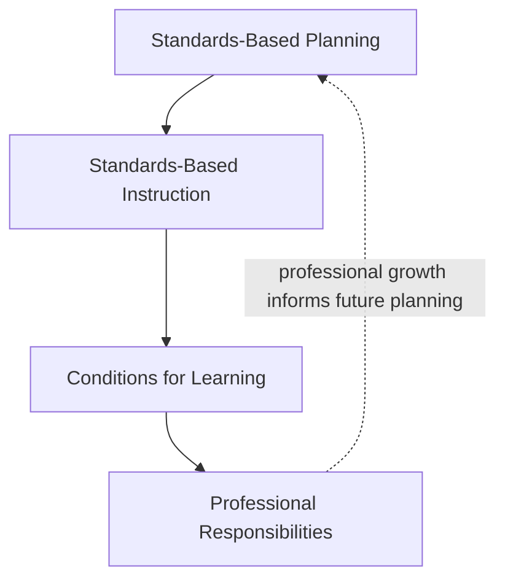
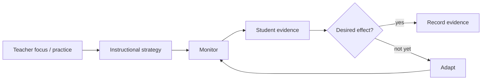

# Marzano Focused Teacher Evaluation Model

## Status

**Primary current-framework research target.**

The Marzano Evaluation Center currently presents the **Focused Teacher Evaluation Model (FTEM)** as a framework of **23 competencies across four domains**. Its current public materials emphasize a theory of action connecting teacher practice to a desired student effect, observable evidence, and adaptation.

Primary references:

- [Current FTEM overview](https://marzanoevaluationcenter.com/evaluation/teacher-evaluation-model/)
- [Current Marzano elements overview](https://marzanoevaluationcenter.com/library/marzano-elements/)

## Four domains

| Domain | Elements | Working interpretation |
|---|---:|---|
| Standards-Based Planning | 3 | Design standards-aligned lessons, tasks, resources, and measures before instruction |
| Standards-Based Instruction | 10 | Select and execute instruction appropriate to the learning target and cognitive demand |
| Conditions for Learning | 7 | Create the assessment, feedback, engagement, relationship, expectations, and procedure conditions that make rigorous learning possible |
| Professional Responsibilities | 3 | Maintain professional practice, expertise, leadership, and collaboration |

## Theory of action

Current Marzano Evaluation Center material describes each element as having a **focus statement**, a **desired effect**, and a **developmental scale**. Our project should not republish proprietary protocols. We can, however, learn the underlying reasoning pattern:

That loop is the heart of the future application.

## Standards-Based Instruction elements

The current public elements article identifies these ten instructional practices:

1. Identifying Critical Content
2. Previewing New Content
3. Processing New Content
4. Using Questions to Help Students Elaborate on Content
5. Reviewing Content
6. Helping Students Practice Skills, Strategies, and Processes
7. Helping Students Examine Similarities and Differences
8. Helping Students Examine Their Reasoning
9. Helping Students Revise Their Knowledge
10. Helping Students Engage in Cognitively Complex Tasks

The article organizes them around increasing cognitive demand, from building foundational knowledge through deeper practice and analysis to knowledge utilization.

## Conditions for Learning elements

The current public source identifies:

### Monitoring student progress and feedback

- Using Formative Assessment to Track Progress
- Providing Feedback and Celebrating Progress

### Rigorous learning

- Organizing Students to Interact with Content
- Using Engagement Strategies

### Classroom environment

- Establishing and Acknowledging Adherence to Rules and Procedures
- Establishing and Maintaining Effective Relationships in Student-Centered Classrooms
- Communicating High Expectations for Each Student to Close the Achievement Gap

## Professional Responsibilities elements

The public source identifies:

1. Adhering to School and District Policies and Procedures
2. Maintaining Expertise in Content and Pedagogy
3. Promoting Teacher Leadership and Collaboration

## Standards-Based Planning

The public current source explicitly names **Planning Standards-Based Lessons/Units** and explains that the other two planning elements address aligned traditional/digital resources and planning measures that track student progress and close achievement gaps. Before we encode exact formal labels for all three, verify them against an authoritative current protocol or licensed district copy rather than filling the labels from memory.

## What we will build around it

Every practice page in this project should eventually answer:

1. What problem is this practice trying to solve?
2. What does it look like when used correctly?
3. What false-positive behavior can look similar but miss the purpose?
4. What should students be doing or demonstrating?
5. What evidence can be collected without student PII?
6. What would trigger an instructional adaptation?
7. What are plausible adaptations?
8. How does the practice change across CS, systems, esports, robotics, and other classroom contexts?
9. How can a teacher reflect on effectiveness after the lesson?
10. What evidence would support a professional growth report?

## Copyright boundary

Element names and high-level factual organization may be referenced for research and commentary. Do not copy full proprietary protocols, developmental scales, scoring guides, evaluator forms, training slides, or copyrighted graphics into this public repository without verified permission.
