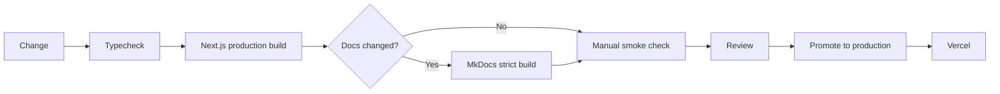

# Local CI and Release Gates

Teaching Practice Lab validates releases **locally before production**. GitHub Actions is intentionally not used as the project's CI gate.

## App gate

Run from the repository root:

```bash
npm install
npm run ci:local
```

`ci:local` currently requires:

1. TypeScript type checking,
2. a successful production Next.js build.

A failing gate blocks production promotion.

## Documentation gate

When documentation, navigation, MkDocs configuration, or Mermaid content changes:

```bash
python -m venv .venv
# Windows: .venv\Scripts\activate
# macOS/Linux: source .venv/bin/activate
pip install -r requirements-docs.txt
mkdocs build --strict
```

A strict MkDocs failure blocks production promotion for documentation changes.

## Manual smoke gate

Before production, verify the primary public routes in the production build or local production server:

- `/`
- `/learn/foundations`
- `/challenge`
- `/api/health`

Also verify:

- navigation works,
- exercise feedback is readable,
- keyboard interaction remains usable,
- mobile layouts do not overflow,
- no proprietary source material was accidentally copied into public course content,
- no student PII exists in committed examples or fixtures.

## Release flow



## Production rule

Vercel is a deployment target, not a test environment. Do not intentionally promote a change to production that has not passed the applicable local gates.

## Badge semantics

README badges must not imply a remote automated CI service exists. Use language such as `CI: local release gates` rather than a fabricated `build passing` badge.
