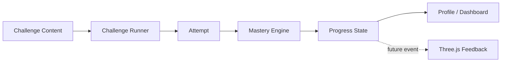

# MVP Learning Shell

Branch: `build/mvp-learning-shell`

The first executable application slice implements the lightweight product shell before authentication, persistence, or Three.js.

## Implemented

- Next.js App Router shell
- dark monospace visual system derived from the approved lightweight dashboard direction
- dashboard
- Foundations learning path
- playable text challenge runner
- mastery profile placeholder
- deterministic mastery engine module
- initial Foundations challenge content

## Current routes

```text
/
/learn/foundations
/challenge
/mastery
```

## Architecture boundary

The challenge content, mastery calculations, and UI are intentionally separate:



Three.js is not part of this first slice. The ordinary learning experience must work without WebGL before animation is added.

## Next implementation slice

1. wire challenge attempts into local persisted progress,
2. apply XP and dimension updates through the mastery engine,
3. add review state,
4. replace placeholder profile values with calculated values,
5. expand the Foundations challenge bank,
6. add a deterministic Foundations boss,
7. only then introduce authentication/database persistence.
