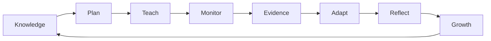

# Teaching Practice Lab

**A documentation-first instructional expertise system.**

The long-term product is not a checklist and not an unofficial evaluator. It is a personal system for learning instructional practice, deliberately applying it, documenting evidence, reflecting on results, and producing defensible reports.

## What exists first

The Markdown documentation is the system of record. GitHub is the lowest-dependency reader and editor. MkDocs Material adds navigation, search, diagrams, and a publishable documentation site. A Next.js application comes later and consumes structured knowledge from this repository rather than becoming a second source of truth.

## Primary research target

The current research target is the **Marzano Focused Teacher Evaluation Model (FTEM)**. The Marzano Evaluation Center currently describes FTEM as 23 competencies across four domains and emphasizes teacher actions, desired effects, student evidence, and instructional adaptation.

We also retain historical notes about the older 2011 60-element model because understanding the lineage helps explain how the focused model was derived. Historical material is not treated as the default implementation target.

## System boundaries

This project may help a teacher prepare, reason, reflect, and organize evidence. It must not impersonate an official evaluator, fabricate ratings, reproduce restricted proprietary protocols, or claim that a locally generated score is an official district evaluation.

## Navigate

Use the **[Documentation Map](SUMMARY.md)** for the complete repository map.
