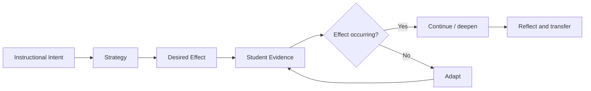

# Foundations Path: Think Like the Framework

This is the first playable learning path and the reference implementation for the rest of the platform.

The goal is not to memorize 23 competency names. The goal is to internalize the reasoning loop that makes the framework coherent:



## Why this path comes first

Every later competency challenge depends on the learner being able to answer:

1. What was the teacher trying to accomplish?
2. What strategy or practice was used?
3. What should students do or understand if it works?
4. What evidence would demonstrate that effect?
5. What evidence is insufficient?
6. What should change when the desired effect is not occurring?
7. How would the teacher defend that decision?

If this reasoning is weak, memorizing framework labels creates false confidence.

## Path map

```text
NODE 01  Framework Orientation
   ↓
NODE 02  Desired Effect
   ↓
NODE 03  Evidence vs Activity
   ↓
NODE 04  Not Enough Evidence
   ↓
NODE 05  Adaptation Loop
   ↓
NODE 06  Distinguish the Concepts
   ↓
NODE 07  Applied Scenario
   ↓
NODE 08  Oral / Written Defense
   ↓
BOSS     The Observation
```

## Node 01: Framework Orientation

### Learner must be able to

- explain why the current FTEM is organized around a smaller set of high-leverage competencies rather than the historical 60-element map,
- name the four current domains,
- explain that the platform is independent training rather than an official evaluation instrument,
- distinguish framework knowledge from a district's actual evaluation procedure.

### Challenge types

- recall,
- recognition,
- map labeling.

## Node 02: Desired Effect

### Core idea

Teacher behavior is not enough. A strategy is meaningful only in relation to the effect it is intended to produce for students.

### Challenges

**Recall**

> Explain `desired effect` without using the phrase “what the teacher does.”

**Recognition**

> A teacher asks students to compare two execution traces. Which response best describes evidence of the desired effect?

**Non-example**

> “The teacher used a comparison chart.” Why is this not evidence of student learning by itself?

### Dimensions

- Recall
- Recognition
- Diagnosis

## Node 03: Evidence vs Activity

### Core idea

Visible activity is not automatically evidence of learning.

The learner practices distinguishing:

```text
students are talking
        ≠
students are demonstrating the intended reasoning
```

### Scenario

Students are in groups discussing a networking lab. Every student appears busy.

Ask:

1. What can you conclude from this observation?
2. What can you **not** conclude?
3. What additional evidence would you seek?
4. What would demonstrate that the instructional strategy produced its desired effect?

### Dimensions

- Discrimination
- Diagnosis

## Node 04: Not Enough Evidence

This node explicitly trains calibrated uncertainty.

### Scenario

> An observer enters for two minutes. Students are silent and writing. Determine whether the teacher is effectively using an engagement strategy.

Correct expert response:

> There is not enough evidence to determine that yet.

The learner must then explain what additional evidence would be needed.

### Achievement

First successful completion unlocks:

**Not Enough Evidence**

> Correctly refused to make an instructional judgment without sufficient evidence.

### Dimensions

- Diagnosis
- Defense

## Node 05: Adaptation Loop

### Core idea

If the desired effect is not occurring broadly enough, the teacher needs to make an instructional decision rather than merely continue the planned activity.

### Scenario

You are teaching Java conditionals. Students can predict program output but most cannot explain why a particular branch executes.

Ask:

1. What evidence indicates the current approach is insufficient?
2. What misconception might be present?
3. What adaptation would you make?
4. What new evidence would tell you whether the adaptation worked?

### Dimensions

- Diagnosis
- Adaptation
- Application

## Node 06: Distinguish the Concepts

The learner receives pairs that sound similar but represent different instructional reasoning.

Early examples:

```text
Activity             vs Evidence
Strategy             vs Desired Effect
Student compliance   vs Student learning
Engagement           vs Cognitive processing
Continue             vs Adapt
Confidence           vs Sufficient evidence
```

The goal is to establish the discrimination mechanic before using it on neighboring FTEM competencies.

### Dimensions

- Discrimination
- Recall

## Node 07: Applied Scenario

### Scenario

Course: Computer Systems
Topic: CPU Scheduling
Time: 42 minutes

Students first predict the order in which a set of processes will execute. They then compare FCFS and Round-Robin results in pairs. The teacher notices that many students can calculate the order correctly but cannot explain the tradeoff between response time and fairness.

The learner must:

1. identify the instructional intent,
2. identify relevant student evidence,
3. separate successful evidence from superficial activity,
4. diagnose the remaining gap,
5. choose an adaptation,
6. state what evidence should be collected next.

### Dimensions

- Application
- Diagnosis
- Adaptation
- Transfer

## Node 08: Defense

### Principal mode

The platform asks, one prompt at a time:

> Why did you have students compare the two scheduling approaches?

Then:

> How did that activity support the learning target?

Then:

> What evidence told you students understood the tradeoff rather than simply completing the calculation?

Then:

> Some students still could not explain it. What did you change?

Then:

> Why did you choose that adaptation?

A strong answer should connect intent, evidence, diagnosis, and adaptation without relying on memorized buzzwords.

### Dimensions

- Defense
- Transfer

## Boss: The Observation

### Format

The learner receives a complete classroom vignette containing:

- a learning target,
- teacher actions,
- student actions,
- student responses,
- an ambiguous observation,
- one failed desired effect,
- an opportunity to adapt.

The boss has six phases:

```text
1. Observe
2. Identify
3. Separate evidence from activity
4. Diagnose
5. Adapt
6. Defend
```

### Clear requirements

Use the global boss rules from `docs/product/mastery-engine.md`:

```text
overall >= 80
Diagnosis >= 70
Adaptation >= 70
Defense >= 70
```

### Reward

- Foundations boss clear
- Framework Explorer achievement
- eligibility for Apprentice I if other rank gates are met
- unlock the first competency-focused path

## Three.js usage in this path

Most nodes should be normal HTML/CSS/React.

Three.js is justified only for:

1. a lightweight animated reasoning graph after Node 02,
2. an evidence-connection animation in Node 03,
3. the boss-introduction sequence.

The Foundations path must remain fully usable if all Three.js components are disabled.

## Content authoring rule

Do not generate fifty variants immediately.

The first version should contain approximately:

- 5 recall prompts,
- 5 recognition prompts,
- 6 evidence-vs-activity challenges,
- 4 insufficient-evidence scenarios,
- 5 adaptation scenarios,
- 5 discrimination challenges,
- 2 integrated applied scenarios,
- 1 defense sequence,
- 1 boss.

Quality and diagnostic value matter more than question-bank size.
