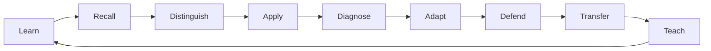

# Product Vision: Teaching Practice Lab

Teaching Practice Lab is a **game-based instructional mastery platform**. Its first framework is the Marzano Focused Teacher Evaluation Model (FTEM), but the product architecture should allow additional instructional frameworks later.

The goal is not course completion, report generation, or rubric memorization. The goal is to develop enough fluency that a learner can recognize, distinguish, apply, diagnose, adapt, defend, and transfer instructional practices under questioning.

## Product thesis

A teacher does not demonstrate mastery by naming an element. Mastery means being able to answer:

- What instructional problem is being solved?
- Why is this practice appropriate here?
- What student effect should occur?
- What evidence would demonstrate that effect?
- What would count as a false positive?
- What should change if the desired effect does not occur?
- How is this different from a nearby or commonly confused practice?
- Can the reasoning be defended without consulting notes?

## Core loop

## Product modes

### Learn

Compact competency lessons, framework history, diagrams, examples, non-examples, and vocabulary.

### Practice

Retrieval prompts, comparison challenges, scenario analysis, evidence selection, error finding, and lesson design.

### Defend

Socratic oral or written questioning in several modes: principal, coach, skeptic, framework expert, and rapid fire.

### Field Lab

A lightweight deliberate-practice mission for a real lesson. No student names or unnecessary student records are required.

### Mastery

A profile showing rank, XP, competency mastery, confidence, review queue, badges, boss clears, and weak areas.

## Game rule

**Activity does not equal mastery.** Reading content should not award meaningful XP. Progress is earned by demonstrating knowledge and reasoning.

## Non-goals

The first product is not:

- an official teacher evaluation system,
- an evaluator certification product,
- a student information system,
- a gradebook,
- an IEP/504 repository,
- a replacement for district observation software,
- a visual effects demo.

Three.js, animation, rewards, and progression exist to support learning. They do not own the learning logic.
