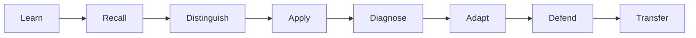

# Product Vision: Teaching Practice Lab

Teaching Practice Lab is an **open-source instructional practice course**. Its first framework is the Marzano Focused Teacher Evaluation Model (FTEM), with historical context from the earlier Marzano Learning Map.

The goal is not certification, score tracking, report generation, or gamification. The goal is to help a teacher understand the framework deeply enough to recognize, distinguish, apply, diagnose, adapt, and defend instructional decisions when questioned.

## Product thesis

A teacher does not demonstrate understanding by naming an element. Useful fluency means being able to answer:

- What instructional problem is being solved?
- Why is this practice appropriate here?
- What student effect should occur?
- What evidence would demonstrate that effect?
- What would count as a false positive?
- What should change if the desired effect does not occur?
- How is this different from a nearby or commonly confused practice?
- Can the reasoning be defended without consulting notes?

## Learning loop

The loop describes how the course is designed. It is not a profile or progress-tracking system.

## Course modes

### Learn

Compact lessons, framework history, diagrams, examples, non-examples, terminology, and source notes.

### Practice

Open retrieval prompts, comparison exercises, scenario analysis, evidence selection, error finding, and lesson design. Exercises can be repeated freely and require no account.

### Defend

Written or spoken prompts modeled on questions from a principal, instructional coach, skeptic, or framework expert.

### Explore

Interactive diagrams and selective Three.js experiences may visualize instructional relationships, evidence, or scenarios when animation materially improves understanding.

## Open-course rule

Core learning must remain available without:

- login,
- learner profile,
- XP,
- rank,
- badge,
- streak,
- saved progress,
- paywall,
- student information.

## Two complementary sites

**MkDocs** is the reference manual: research notes, framework documentation, sources, diagrams, architecture, and contributor guidance.

**Next.js** is the learning experience: readable course pages, interactive exercises, comparison tools, scenario practice, and optional visualizations.

Both are backed by repository content and should remain useful when browsed directly on GitHub.

## Non-goals

The project is not:

- an official teacher evaluation system,
- evaluator certification,
- a student information system,
- a gradebook,
- an IEP/504 repository,
- a replacement for district observation software,
- a proprietary clone of Marzano materials,
- a visual-effects demo.

The project should teach from documented sources using original explanations, examples, exercises, and diagrams while respecting copyright and attribution boundaries.
