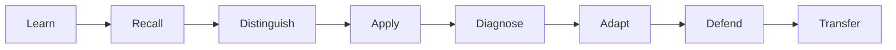

# Product Vision: Teaching Practice Lab

Teaching Practice Lab is a **publicly accessible instructional practice course owned by Gh0stlyKn1ght**. Its first framework is the Marzano Focused Teacher Evaluation Model (FTEM), with historical context from the earlier Marzano Learning Map.

The website is intended to be freely reachable on the public web, but the project's original source code, course content, exercises, diagrams, and design are proprietary unless explicitly stated otherwise.

The goal is not certification, score tracking, report generation, or gamification. The goal is to help a teacher understand the framework deeply enough to recognize, distinguish, apply, diagnose, adapt, and defend instructional decisions when questioned.

## Product thesis

Useful fluency means being able to answer:

- What instructional problem is being solved?
- Why is this practice appropriate here?
- What student effect should occur?
- What evidence would demonstrate that effect?
- What would count as a false positive?
- What should change if the desired effect does not occur?
- How is this different from a nearby or commonly confused practice?
- Can the reasoning be defended without consulting notes?

## Learning loop

## Course modes

### Learn

Compact lessons, framework history, diagrams, examples, non-examples, terminology, and source notes.

### Practice

Repeatable retrieval prompts, comparison exercises, scenario analysis, evidence selection, error finding, and lesson design. Exercises require no account.

### Defend

Written or spoken prompts modeled on questions from a principal, instructional coach, skeptic, or framework expert.

### Explore

Interactive diagrams and selective Three.js experiences may visualize instructional relationships, evidence, or scenarios when animation materially improves understanding.

## Public-access rule

Core learning should remain usable without:

- login,
- learner profile,
- XP,
- rank,
- badge,
- streak,
- saved progress,
- student information.

Public access does not mean open source. See the repository `LICENSE` file for ownership terms.

## Presentation layers

**MkDocs** is the research and reference manual.

**Next.js** is the primary public learning experience.

**Vercel** is the intended production host.

Production changes are validated with local release gates before intentional promotion.

## Non-goals

The project is not:

- an official teacher evaluation system,
- evaluator certification,
- a student information system,
- a gradebook,
- an IEP/504 repository,
- a replacement for district observation software,
- an unauthorized reproduction of proprietary Marzano materials,
- a visual-effects demo.

Teaching Practice Lab should teach from documented sources using original explanations, examples, exercises, and diagrams while respecting third-party copyrights and trademarks.

Copyright © 2026 Gh0stlyKn1ght. All Rights Reserved.
