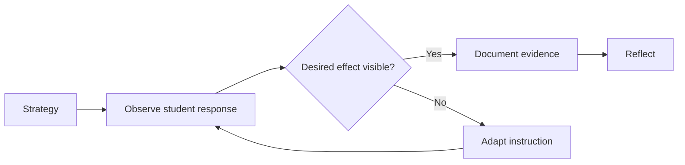

# Project Doctrine

## Mission

Build a durable personal instructional-practice system that turns a teaching framework into repeated cycles of **understanding, planning, classroom use, evidence collection, adaptation, reflection, and growth**.

## Non-goals

This repository is not:

- an official Marzano product,
- evaluator certification,
- an automated teacher-rating engine,
- a replacement for district policy or evaluator training,
- a place to store identifiable student records,
- a mirror of proprietary rubrics or copyrighted training materials.

## Design principles

### 1. Documentation before application

The knowledge model must be understandable as plain files before it is represented by UI components.

### 2. One source of truth

Concepts, source metadata, schemas, and original training material live in this repository. MkDocs and the future Next.js app are different renderers of the same knowledge system.

### 3. Evidence over activity

A teaching action is not considered successful merely because it occurred. The system asks what students did, understood, produced, changed, or demonstrated as a result.

### 4. Adaptation matters

The important loop is not `strategy → score`. It is:

### 5. Separate fact from interpretation

Every important framework claim should be traceable to a source. Our explanations, classroom examples, mappings, and interpretations must be marked as original analysis when they go beyond a source.

### 6. No student PII by default

Prefer aggregate evidence such as `18 of 22 students demonstrated...`. Avoid names, IDs, IEP information, disability details, disciplinary records, or other sensitive records.

### 7. Reports summarize evidence, not invent it

Generated reports can reorganize and synthesize stored evidence. They must never manufacture classroom observations or imply an official evaluation score.

## Product sequence

1. Research and documentation system
2. MkDocs publication
3. Structured schemas and validators
4. Practice/evidence journal
5. Printable reports
6. Calibration scenarios
7. Interactive Next.js knowledge map
8. Optional AI-assisted reflection with strict evidence boundaries
